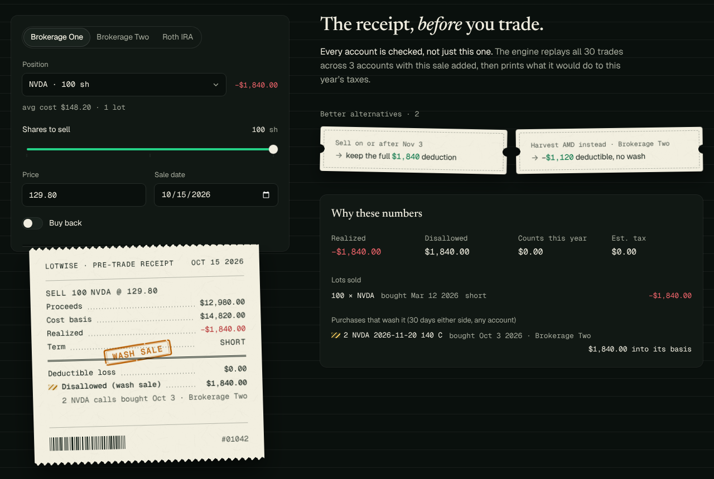
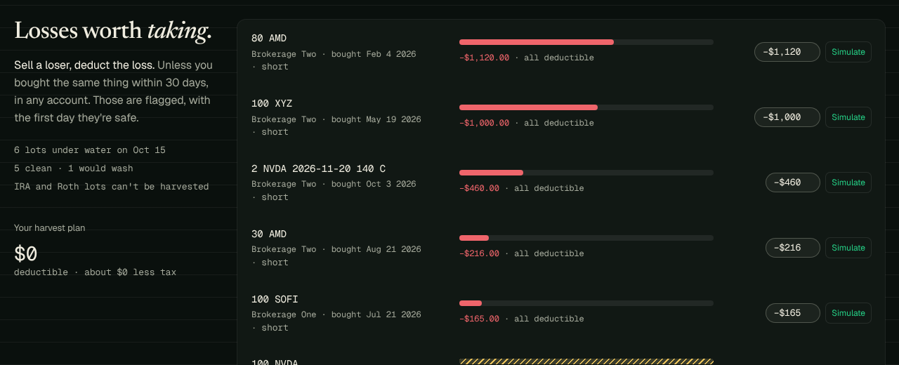

# Lotwise

**Know the tax bill before you click sell.**

Lotwise checks every account you own for wash sales and hands you the tax receipt for a trade
*before* you place it. The tax engine is written in Rust, compiled to WebAssembly and runs
entirely in your browser; your agents can ask it too, through an MCP server.

- **Site:** https://lotwise-seven.vercel.app
- **Demo:** https://lotwise-seven.vercel.app/demo (three accounts, thirty trades, a sale you're about to regret)
- **Agents / MCP:** https://lotwise-seven.vercel.app/agents · [`mcp/`](mcp/)

> **Estimates only — not tax advice.** Lotwise models US federal capital-gains rules with the
> simplifications listed in [`docs/PRODUCT_PLAN.md`](docs/PRODUCT_PLAN.md). Check with a tax professional.



## What it does

- **Pre-trade receipt.** Proceeds, basis, realized, short or long term, what's deductible, what a
  wash sale disallows and *which purchase in which account* caused it, the estimated tax, and
  coupons for better options (sell on/after a date, rebuy after a date, harvest something else).
- **Wash sales across all your accounts.** A loss sale plus a substantially identical purchase
  within 30 days before or after, anywhere: pro-rated by shares, basis and holding period carried
  into the replacement, chained; an IRA/Roth replacement makes the loss **permanent**. Calls (and
  flagged deep-in-the-money written puts) count.
- **Tax lots.** FIFO, LIFO, highest-cost or specific lots; partial sales; the long-term countdown
  (leap days included) and what waiting saves.
- **Section 1256.** SPX, XSP, NDX, RUT and friends: 60/40 regardless of holding period, no wash sales.
- **Loss harvesting.** Losing lots ranked, the ones that would wash flagged with their safe date.
- **Your data stays yours.** The demo saves to your browser only. Import a Lotwise CSV/JSON or a
  Schwab export; export any time; clear everything in one click.



## Architecture

```
engine/  (Rust crate: lots, wash sales, 1256, receipt, scans; decimal money)
   │  cargo build --target wasm32 + wasm-bindgen --target web   (scripts/build-engine.sh)
   ▼
lib/engine/wasm/  (committed .wasm + JS glue, ~114 KB gzipped)
   │
   ├── lib/engine/wasm.ts ─┬─ /demo app (components/demo/*, loaded on demand)
   │                       └─ explainers on /learn (sync facade in lib/engine/index.ts)
   │
   └── mcp/  (stdio MCP server, same .wasm in Node; bundled to mcp/dist/lotwise-mcp.mjs)
```

- `engine/` is the source of truth. JSON strings cross the WASM boundary, so the browser, Node and
  the Rust tests see identical behaviour. Money and quantities are decimal strings.
- 36 hand-computed fixtures in `engine/tests/fixtures/` run in `cargo test` **and** against the
  WASM build from Vitest (`tests/engine-parity.test.ts`).
- The landing page never loads the WASM (Lighthouse stays where it was). Its explainers use a
  TypeScript reference model that a parity test holds to the cent against the real engine for
  every input the site produces, and switch to the WASM engine once it loads.
- Vercel has no Rust toolchain, so the built WASM is committed; CI rebuilds it and fails on any
  difference. The build is byte-reproducible across machines.

## Run it

```bash
npm ci
npm run dev            # http://localhost:3000, /demo, /agents, /learn
npm test               # Vitest: copy numbers, parity with the WASM engine, trade files
npm run lint && npm run typecheck
npm run build && npx playwright test --project='chromium-*'   # e2e + axe
```

### The engine

Needs Rust (the version is pinned in `engine/rust-toolchain.toml`) with the
`wasm32-unknown-unknown` target, and `wasm-bindgen-cli` at the exact version in `engine/Cargo.lock`:

```bash
rustup target add wasm32-unknown-unknown
cargo install wasm-bindgen-cli --version 0.2.129 --locked
npm run engine:test    # cargo test: unit tests, fixtures, property tests
npm run engine:build   # rebuild lib/engine/wasm (and mcp/dist's copy); commit the result
npm run engine:check   # rebuild and fail if the committed artifacts differ
```

### The MCP server

```bash
node mcp/dist/lotwise-mcp.mjs --demo --help
claude mcp add lotwise -- npx -y github:SriharshaPotta/lotwise --data ~/lotwise-trades.csv
```

Setup for Claude Code, Claude Desktop and Cursor: [`mcp/README.md`](mcp/README.md) or
[/agents](https://lotwise-seven.vercel.app/agents).

## Repository map

| Path | What |
|---|---|
| `engine/` | Rust tax engine, fixtures, property tests |
| `lib/engine/` | WASM build, typed wrapper, reference model, `Engine` interface |
| `lib/portfolio/` | Demo portfolio, CSV/JSON/Schwab formats, browser storage |
| `lib/demo/` | Scenarios behind every number in the marketing copy |
| `app/`, `components/` | Next.js site: landing, `/demo`, `/learn`, `/agents` |
| `mcp/` | MCP server (source, tests, committed bundle) |
| `tests/`, `e2e/` | Vitest and Playwright |
| `docs/PRODUCT_PLAN.md` | Rules, simplifications, decisions, known gaps |
| `DESIGN.md` | The design system ("the private ledger") |

## License

[MIT](LICENSE). Contributions welcome: see [CONTRIBUTING.md](CONTRIBUTING.md).
